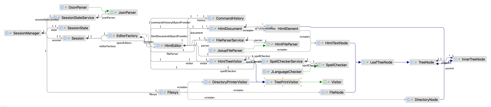
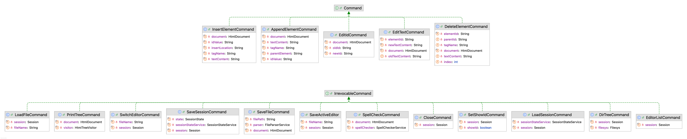

# Lab1 实验报告

> 黄宝岱 22307130480
## 一、项目介绍

本项目实现了一个命令行交互式 HTML 编辑器，支持 HTML 文件的加载、编辑、结构展示与拼写检查，同时支持多文件会话管理。项目采用模块化设计，使用命令模式、工厂模式与访问者模式组织结构，具备良好的可扩展性。

### 1. 命令支持

支持所有基础命令和增强部分命令，包括：

```java
/************基础命令************/
insert tagName idValue insertLocation [textContent]
append tagName idValue parentElement [textContent]
edit-id oldId newId
edit-text element [newTextContent]
delete element
print-tree
spell-check
undo
redo
/************增强命令************/
load filename.html
save filename.html
close
editor-list
edit filename.html
showid true/false
dir-tree
/************其他命令************/
help
exit
```

除项目要求外，对命令做以下说明：

- 增强部分`load`和`save`与基础部分的`init`/`read`/`save`冲突，只保留增强部分的命令。
- 进入程序后可以选择使用当前目录作为工作目录，或自己指定工作目录。`load`和`save`指令后所跟的`filename.html`支持所有相对于工作目录的相对路径。
- 使用`close`命令关闭editor，会询问是否要保存。但是在对文件有修改的情况下，不使用`close`命令直接用`exit`退出编辑器，所有的编辑不会保存。
- 调用`save`命令后，文件的“已编辑”状态重置（不会再算做已编辑状态）
- 要求进入程序后先使用`load`命令装入文件。
- 可使用`help`命令在程序中查看所有可用命令。

<div style="page-break-after: always;"></div>

## 二、运行与测试说明

- **项目构建工具**：Maven

- **Java 版本**：JDK 23

- **依赖安装**：

    - 若使用 IntelliJ IDEA 或 Eclipse 等 IDE，可直接通过 Maven 导入依赖，或：

    - 命令行构建依赖：

      ```
      mvn clean install
      ```

- **运行程序**：

    - 通过IDE直接运行，或：
      
    - 在命令行中运行 `Main.java`：

        ```bash
        mvn clean compile
        mvn exec:java -Dexec.mainClass=org.example.Main
        ```

- **自动化测试**：
    - 所有单元测试位于 `src/test/java`

    - 通过IDE直接运行测试，或：

    - 执行所有测试命令：

      ```
      mvn test
      ```

## 三、项目结构

### 1. 文件结构

项目结构如下：

```
.
├── AppConfig.java	// 配置
├── Main.java				// 运行入口
├── cli							// 命令行界面
│   └── CommandLineInterface.java
├── commands				// Command接口和具体实现。
│   ├── AppendElementCommand.java
│   ├── CloseCommand.java
│   ├── Command.java								// 可撤回的命令(interface)
│   ├── DeleteElementCommand.java
│   ├── DirTreeCommand.java
│   ├── EditIdCommand.java
│   ├── EditTextCommand.java
│   ├── EditorListCommand.java
│   ├── InsertElementCommand.java
│   ├── IrrevocableCommand.java			// 不可撤回的命令(interface)
│   ├── LoadFileCommand.java
│   ├── LoadSessionCommand.java
│   ├── PrintTreeCommand.java
│   ├── SaveActiveEditor.java
│   ├── SaveFileCommand.java
│   ├── SaveSessionCommand.java
│   ├── SetShowIdCommand.java
│   ├── SpellCheckCommand.java
│   └── SwitchEditorCommand.java
├── document												// Html文档模型。包含Html文档、两种节点和访问者。
│   ├── HtmlDocument.java
│   ├── HtmlElement.java
│   ├── HtmlTextNode.java
│   └── HtmlTreeVisitor.java
├── editor													// editor包实现了命令模式，对document(Receiver)进行操作。
│   ├── CommandHistory.java					// Invoker，持有命令对象，并维护undo/redo stack实现相关操作。
│   ├── EditorFactory.java					// Editor的工厂类，用于装配Editor与通过Bean注入的外部服务。
│   └── HtmlEditor.java							// Client，组装对象，向外提供不同方法的接口。
├── session													// session管理
│   ├── Session.java								// Receiver，储存openEditors、activeEditor等信息
│   └── SessionManager.java					// Invoker，调用command执行命令
└── tools
    ├── SessionStateSaver						// 用于在进入时加载状态、退出时保存状态
    │   ├── GsonStateService.java			// 使用Gson的接口实现
    │   ├── SessionState.java
    │   └── SessionStateService.java	// 接口
    ├── filesys											// 用于dir-tree命令，没有依赖外部服务
    │   ├── DirectoryNode.java
    │   ├── DirectoryPrinterVisitor.java
    │   ├── FileNode.java
    │   └── Filesys.java
    ├── htmlparser									// 用于读入和保存html文档
    │   ├── FileParserService.java	// 调用接口，实现保存/读入文件的逻辑
    │   ├── HtmlFileParser.java			// 接口
    │   └── JsoupFileParser.java		// 使用Jsoup的接口实现
    ├── spellchecker								// 拼写检查
    │   ├── JLanguageChecker.java		// 使用JLanguageChecker的接口实现
    │   ├── SpellChecker.java				// 接口
    │   └── SpellCheckerService.java	// 调用接口，实现拼写检查逻辑
    ├── treeprinter									// 定义可复用的树形结构打印器，具体打印逻辑由HtmlTreeVisitor和
    │   ├── InnerTreeNode.java			// DirectoryPrinterVisitor 实现
    │   ├── LeafTreeNode.java
    │   ├── TreeNode.java
    │   ├── TreePrintVisitor.java
    │   └── Visitor.java
    └── utils
        ├── CommandTable.java
        ├── PathUtils.java
        └── PrintTreeUtils.java

```


### 2. 外部依赖

项目中使用了以下外部依赖：

| **依赖名称**                                                 | **用途**            | **Scope**              |
| ------------------------------------------------------------ | ------------------- | ---------------------- |
| **jsoup** <br />(org.jsoup:jsoup:1.16.1)                     | 解析Html文档        | Runtime                |
| **LanguageTool English module** (org.languagetool:language-en:6.6) | 实现拼写检查功能    | Runtime                |
| **logback-classic**<br /> (ch.qos.logback:logback-classic:1.4.14) | 记录运行时日志      | Runtime                |
| **Gson**<br /> (com.google.code.gson:gson:2.10.1)            | 解析/保存编辑器状态 | Runtime                |
| **JUnit** <br />(junit:junit 和 org.junit.jupiter:junit-jupiter) | 自动化测试          | Test                   |
| **Mockito**<br /> (org.mockito:mockito-core, mockito-junit-jupiter) | 测试中模拟组件行为  | Test                   |
| **Lombok**<br /> (org.projectlombok:lombok:1.18.30)          | 提高代码简洁性      | 编译期依赖，不参与打包 |


## 四、依赖关系

### 1. UML类图

使用IDEA生成项目的UML类图，如图所示（请查看原图）：



<div style="page-break-after: always;"></div>

仅包含继承关系的图：


使用Spring Bean管理的依赖：


### 2. 文字说明

- 核心控制模块

  - **Main**：启动类，初始化 CommandLineInterface 并启动程序。

  - **CommandLineInterface**：负责读取、解析用户命令，并委托执行。依赖：
    - CommandTable
    - 由Bean管理的依赖：
      - SessionManager

- Session管理
  - **SessionManager**：操作Session模块，管理当前会话。依赖：
    - *Command
    - 由bean管理的依赖：
      - SessionStateService
      - Session
      - Filesys
      - SessionState
  - **Session**：管理当前Session中所有打开的编辑器。依赖：
    - HtmlEditor
    - 由Bean管理的依赖：
      - EditorFactory

- Html文件管理：

  - **HtmlEditor**：操作`document`，管理当前文件内的操作。由HtmlFactory创建并注入依赖。依赖：
  - SpellCheckerService
    - FileParserService
    - HtmlTreeVisitor
    - CommandHistory：管理Command的redo/undo stack
    - HtmlDocument
  - **CommandHistory**：
    - 管理Command的redo/undo stack，不依赖任何具体命令的实现。为Command和IrrevocableCommand两个接口提供了重载的`excecute`方法，以适应不同的命令要求。
    - CommandHistory是`prototype`的Bean，在HtmlFactory装配Editor时进行依赖注入。
  - **EditorFactory**：由Bean管理的工厂类，用于装配Editor。其依赖全部由Bean注入：
    - SpellCheckerService
    - FileParserService
    - HtmlTreeVisitor
    - ObjectProvider\<CommandHistory> （为每个editor获取单独的history）
    - ObjectProvider\<HtmlDocument> （为每个editor获取单独的document）

- Command

  - **Command*(Interface)* **：为所有可撤回的命令提供接口
  - **IrrevocableCommand*(Interface)* **：为所有不可撤回的命令提供接口

  - Command包下的其他命令都继承自这两个接口；其依赖全部由Editor/SessionManager进行注入。

- Html文件类：

  - **HtmlDocument**：管理整个Html文件的节点。依赖：
    - HtmlElement
  - **HtmlElement**：Html节点。继承自InnerTreeNode，以实现树形结构的打印。依赖：
    - HtmlTextNode
    - InnerTreeNode
  - **HtmlTextNode**：HtmlElement下储存文本的节点。继承自LeafTreeNode，以实现树形结构打印。依赖：
    - LeafTreeNode
  - **HtmlTreeVisitor**：定义访问HtmlTree的具体逻辑。
    - 依赖SpellCheckService，由Bean注入。

- 其他：

  - **treeprinter**：树形结构打印包
    - 树形结构打印器的抽象。
    - 定义了Visitor接口，以及`TreeNode`/`TreePrintVisitor`等抽象类。项目中需要实现对工作目录和Html文件两种树的打印，因此抽象出了树形打印的基础逻辑，放在该模块下。
    - 项目中涉及的树形结构内容继承`InnerTreeNode`和`LeafTreeNode`；不同模块的具体Visitor继承`TreePrintVisitor`类，从而实现树形结构打印代码的复用。
    - 具体继承关系请见前面的图。
  - **filesys**：支持工作目录树形结构打印。
    - 继承treeprinter的类。
  - **htmlparser**：进行html文件和自定义的document数据结构之间的转换。
    - **HtmlFileParser**：接口类，定义 `parser` 和 `rebuild` 两个方法。
    - **JsoupFileParser**：用Jsoup实现HtmlFileParser
    - **FileParserService**：调用HtmlFileParser的接口，处理文件IO和具体逻辑。
  - **SessionStateSaver**：将程序状态保存成json文件，实现持久化。
    - **SessionStateService**：接口类
    - **GsonStateService**：用Gson实现SessionStateService
    - **SessionState**：SessionState的数据结构
  - **SpellChecker**：进行文本的语法检查。
    - **SpellChecker**：接口类，定义`checkText` 接口
    - **JLanguageChecker**：用JLanguageChecker实现SpellChecker.
    - 

<div style="page-break-after: always;"></div>

## 五、设计决策

### 1. 设计模式

#### Composite 模式

项目中包含Html文档和文件目录结构两个树状结构。因此，我采用 Composite 模式建模树状结构，并定义TreeNode 作为所有节点的抽象接口，继承自TreeNode节点的抽象类 InnerTreeNode 和 LeafTreeNode 分别表示可包含子节点的结构节点与叶子节点。

我通过继承方式引入具体的树状节点类型（Html结构或文件目录结构）。具体继承关系如图所示：


 这种设计不仅清晰划分了结构与内容，还具备良好的可扩展性，便于后续加入新的树形结构。

---

#### Visitor 模式

为了在不修改 HTML 树节点类的前提下实现多种操作（如打印、导出、统计等），我采用了 **Visitor 模式**。该模式通过将操作封装在 Visitor 类中，使得对节点结构的扩展与对功能的扩展相互解耦。

##### 模式结构：

- Abstract Visitor：由Visitor接口实现。
- Concrete Visitor：由于项目中使用的两种visitor的作用都是进行树形结构的打印，因此我使用继承抽象类的方法来尽可能实现代码的复用。
  - TreePrintVisitor：抽象类，通过`visitInnerNode`和`visitLeafNode`实现遍历树的基本逻辑，同时保留`visit`接口给具体类实现。
  - HtmlTreeVisitor：继承TreePrintVisitor，在其实现的`visit` 方法中结合` showId` 确定该节点要打印的文本，并调用TreePrintVisitor中的方法进行打印。
  - DirectoryPrinterVisitor：同理。


- Abstract Element：TreeNode
- Concrete Element：LeafTreeNode、InnerTreeNode以及继承它们的类。实现了`accept(Visitor)`方法。

---

#### Command 模式

为了将命令的发起者与执行者解耦，我在项目中引入了 **Command 模式**。该模式封装了用户命令的请求，使得可以灵活扩展命令种类、支持撤销操作、并统一管理用户交互逻辑。

##### 模式结构：

- **Command 接口**：定义了三种不同的命令接口：Command、IrrevocableCommand、SessionCommand
  - Command：可撤回的Editor层命令接口
  - IrrevocableCommand：不可撤回的Editor层命令接口
  - SessionCommand：不可撤回的Session层接口

- **ConcreteCommand（具体命令类）**：如图所示：

  

- **Receiver（接收者）**：
  - Editor层：Document
  - Session层：Session

- **Invoker（调用者）**：
  - Editor层：CommandHistory
  - Session层：SessionManager

- **Client（客户端）**：
  - Editor层：Editor
  - Session层：SessionManager（Session层不需要管理命令的redo和undo，因此简化逻辑，合并Client和Invoker）

---

### 2. 其他设计决策

- **抽象出 TreeNode 结构以复用树形展示逻辑**

  项目中引入了 TreeNode 抽象类，分别由 InnerTreeNode 和 LeafTreeNode 继承，HtmlElement 作为子类实现。这一设计使得不同结构的元素都可以通过统一接口参与到树形结构的构建和打印中，极大提升了代码复用性与扩展性。

- **对外部依赖进行局部隔离以增强稳定性**

  jsoup、LanguageTool 等外部库在功能上较强大但运行时依赖较重。为提升系统的健壮性与可测试性，本项目显式限制了它们的使用范围，仅在必要的模块（如 HTML 解析与拼写检查）中注入使用，而非全局依赖，避免了模块之间的强耦合。

- **工具类设计为可实例化对象，便于调试与扩展**

  传统 static 工具类虽然使用方便，但不利于调试与依赖注入。为了更好的可测试性和未来可能的多态扩展，项目中的工具类（如 SpellChecker）设计为普通实例类，便于后续扩展或在测试中替换。

- **保持模块间依赖关系清晰简洁，提升可维护性**，例如：

  - Session 模块仅依赖 Editor，关注会话管理；
  - Document 仅依赖 HtmlElement 层，专注内容结构；

  通过明确职责分离和依赖最小化，项目整体结构**简洁清晰，依赖路径短**，为测试、维护和重构带来极大便利。

